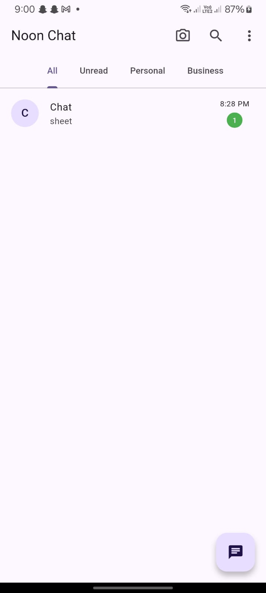
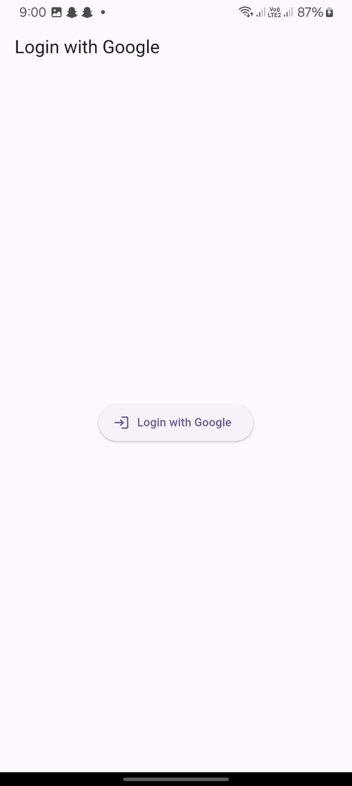
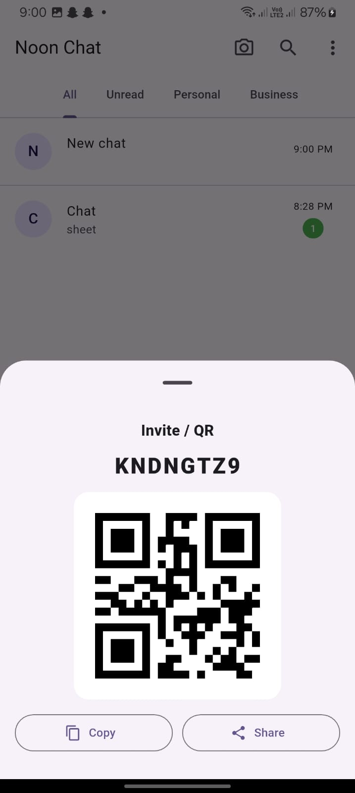
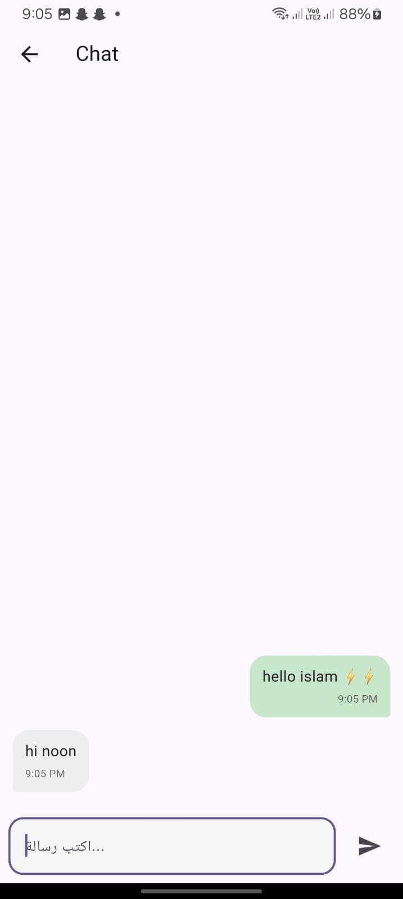

# 📱 Noon Chat

A real-time chat application built with **Flutter & Firebase**.

## ✨ Features
- Google Sign-In Authentication
- Real-time messaging using Firestore
- Invite system with unique codes
- QR code sharing
- Delete chats from your inbox
- Clean chat UI with message bubbles

## 🛠 Tech Stack
- Flutter (Dart)
- Firebase Authentication
- Cloud Firestore
- Google Sign-In
- QR Flutter
- Share Plus

## 🚀 How to Run
```bash
flutter pub get
flutter run
```
> **ترقية:** تم ترقية حزم Firebase إلى FlutterFire 4.10.0. للتفاصيل انظر [UPGRADE.md](UPGRADE.md).
## 

## 📸 Screenshots
## 








